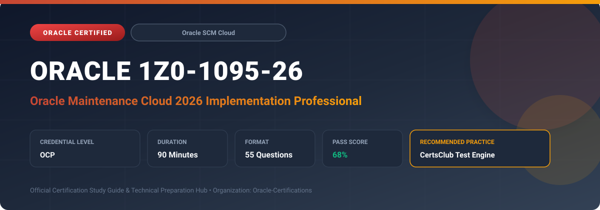

  

# Oracle 1Z0-1095-26: Oracle Maintenance Cloud 2026 Implementation Professional

---

## 1. Exam Overview & Candidate Profile

The **Oracle 1Z0-1095-26: Oracle Maintenance Cloud 2026 Implementation Professional** certification validates implementation consultants and enterprise specialists in architecting and executing asset maintenance workflows in Oracle Fusion Cloud Maintenance.

Candidates validate expertise across asset lifecycles, work definitions, maintenance work orders, preventive and condition-based maintenance programs, inventory integration, cost management, and IoT asset monitoring.

### Target Audience & Prerequisites
- **Target Roles**: Implementation Specialists, Cloud Architects, Technical Leads, Enterprise Consultants, and Systems Engineers.
- **Recommended Experience**: 1–2 years of practical, hands-on experience designing, implementing, and maintaining corresponding Oracle solutions.
- **Credential Earned**: OCP Certification.

---

## 2. Key Exam Specifications

| Specification | Details |
| :--- | :--- |
| **Exam Code** | **Oracle 1Z0-1095-26** |
| **Official Title** | Oracle Maintenance Cloud 2026 Implementation Professional |
| **Certification Track** | Oracle SCM Cloud |
| **Exam Duration** | 90 Minutes |
| **Number of Questions** | 55 Questions |
| **Passing Score** | 68% |
| **Question Format** | Multiple Choice (Single/Multiple Answer), Scenario-Based Questions |
| **Delivery Provider** | Oracle University / Pearson VUE (Online Proctored or Test Center) |
| **Recommended Practice Engine** | [CertsClub Oracle Practice Tests](https://www.certsclub.com/oracle/1z0-1095-26-dumps.html) |

---

## 3. Official Blueprint & Exam Domain Breakdown

The examination assesses candidate competencies across core functional domains weighted as follows:

| Domain Area | Weighting |
| :--- | :--- |
| **Asset Lifecycle Management & Hierarchy Setup** | `25%` |
| **Maintenance Work Definitions & Work Orders** | `25%` |
| **Preventive & Condition-Based Maintenance Programs** | `20%` |
| **Materials, Procurement & Inventory Integration** | `15%` |
| **Maintenance Costing, Accounting & IoT Integration** | `15%` |

---

## 4. Deep Dive into Complex & Challenging Technical Topics

To secure a passing score on the 1Z0-1095-26 exam, candidates must master the following advanced concepts:

- Configuring asset tracking hierarchies, parent-child asset structures, meters, and warranties.
- Creating standard and non-standard maintenance work definitions with operations, resources, and component items.
- Managing maintenance work order execution, dispatch lists, material issuance, and labor time recording.
- Setting up calendar-based, meter-based, and IoT-driven preventive maintenance forecasting.
- Analyzing maintenance variances and cost distributions within Oracle Cost Management.

---

## 5. Scenario-Based Demo & Practice Questions

### Question 1
An asset manager needs to automatically trigger a maintenance work order whenever a hydraulic pump exceeds 1,500 continuous operating hours. Which Oracle Maintenance Cloud feature should be configured?

A) Meter-Based Preventive Maintenance Program
B) Standard Work Order Template
C) Supplier Warranty Claim Rule
D) Work Definition Operation Resource

- **Correct Answer**: `A) Meter-Based Preventive Maintenance Program`  
- **Technical Explanation**: Preventive maintenance programs support meter-based intervals, enabling automatic work order generation when cumulative or gauge meter readings cross defined thresholds.

---

### Question 2
When creating a maintenance work order with required component materials, what triggers the reservation and issuance of stock items from Oracle Inventory Management?

A) Releasing the maintenance work order
B) Defining the asset serial number
C) Closing the accounting period
D) Updating the meter reading

- **Correct Answer**: `A) Releasing the maintenance work order`  
- **Technical Explanation**: When a maintenance work order transitions to the 'Released' status, material requirements are submitted to inventory for automatic reservation and picking staging.

---

## 6. Recommended Preparation Strategy & Practice Testing Engine

Achieving certification in **Oracle 1Z0-1095-26** requires balanced theoretical study and scenario-based simulation practice:

1. **Review Oracle Documentation**: Master architecture guides, implementation workbooks, and administration manuals on the Oracle Help Center.
2. **Hands-on Lab Practice**: Execute real-world configuration, policy setup, and troubleshooting tasks in your cloud tenancy or test instance.
3. **Simulated Exam Drills**: Practice answering timed, scenario-based multiple-choice questions to familiarize yourself with the question formats, traps, and timing constraints.

### Practice With CertsClub
For realistic practice questions, updated dumps, and mock testing environments:
- **Resource**: [CertsClub Oracle Practice Test Engine](https://www.certsclub.com/oracle/1z0-1095-26-dumps.html)
- **Special Discount**: Use coupon code **`club20`** during checkout for an instant **20% discount** on all practice exam bundles and testing engines.

---

## 7. Official Documentation & References

- [Oracle University Certification Registry](https://education.oracle.com/)
- [Oracle Help Center Documentation Portal](https://docs.oracle.com/)
- [Oracle Cloud Infrastructure & Applications Guides](https://docs.oracle.com/en/cloud/)
- [CertsClub Oracle Certification Exam Practice](https://www.certsclub.com/oracle/1z0-1095-26-dumps.html)

---

## 8. SEO & Discovery Keywords

`oracle 1z0-1095-26, oracle 1z0-1095-26 exam, oracle 1z0-1095-26 dumps, 1Z0-1095-26 practice questions, 1Z0-1095-26 study guide, oracle maintenance cloud 2026 implementation professional, certsclub 1z0-1095-26`